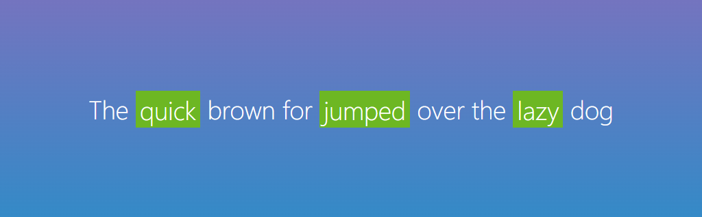
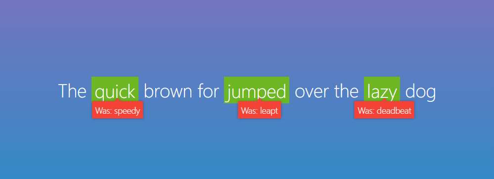

# HTML DEL & INS Tag as a Tooltip

This is a example for [HTML del and ins tag as a Tooltip](https://hilarious-paletas-3ff6eb.netlify.app).This example help you improve your coding skills by building realistic projects.

## Table of contents

- [Overview](#overview)
  - [The challenge](#the-challenge)
  - [Screenshot](#screenshot)
  - [Links](#links)
- [My process](#my-process)
  - [Built with](#built-with)
  - [What I learned](#what-i-learned)
  - [Useful resources](#useful-resources)
- [Author](#author)
- [Acknowledgments](#acknowledgments)

## Overview


### The challenge

- Build out the project to the designs provided

### Screenshot
After Hover



Before Hover



### Links

- Solution URL: [HTML del & ins as a tooltip](https://github.com/montyaction/HTML-del_and_ins_as_a_tooltip)
- Live Site URL: [html_del&ins_as_a_tooltip](https://hilarious-paletas-3ff6eb.netlify.app/)


## My process

### Built with

- HTML
- Ins Tag
- Del Tag
- Hover Effect
- Responsive Design
- [Sass](https://sass-lang.com/) - Css preprocesor


### What I learned

Use this section to recap over some of your major learnings while working through this project. Writing these out and providing code samples of areas you want to highlight is a great way to reinforce your own knowledge.

To see how you can add code snippets, see below:

```html
    <P>
        The
        <span>
            <ins>quick</ins>
            <del>speedy</del>
        </span>
        brown for
        <span>
            <ins>jumped</ins>
            <del>leapt</del>
        </span>
        over the
        <span>
            <ins>lazy</ins>
            <del>deadbeat</del>
        </span>
        dog
    </P>
```
```scss
ins{
  animation: fadeInIns .25s 1s ease-in forwards;
}

@keyframes fadeInIns {
    from {
        background: transparent;
    }
    to {
        background: #6db723;
    }
}
```

### Useful resources

- [W3 School](https://www.w3schools.com/default.asp) - This helped me for my basic knowledge. I really liked this pattern and will use it going forward.
- [MDN](https://developer.mozilla.org/en-US/) - This is an amazing article which helped me finally understand meaning each code. I'd recommend it to anyone still learning this concept.


## Author

- Portfolio - [montyaction](https://blissful-banach-06fb18.netlify.app/
)
- Frontend Mentor - [@montyaction](https://www.frontendmentor.io/profile/montyaction)
- Twitter - [@MontyKanwar19](https://twitter.com/MontyKanwar19)
- Instagram - [frontend_action](https://www.instagram.com/frontend_action/)
